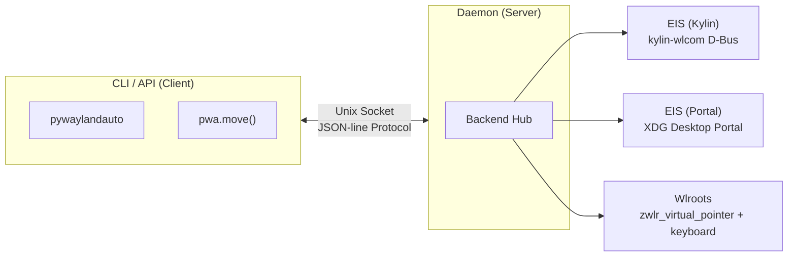

<p align="center">
  
  
  
  
</p>

<h3 align="center">🖱️ ⌨️</h3>
<h1 align="center">pywaylandauto</h1>
<p align="center">
  <b>Wayland 全局键鼠注入引擎</b><br/>
  <sub>一套 API，征服所有 Wayland 桌面。无需 root，开箱即用。</sub>
</p>

---

## ✨ 为什么选择 pywaylandauto

在 Wayland 下模拟键盘鼠标输入 —— Linux 自动化生态的"最后一块拼图"。

X11 时代有 `xdotool`、`pyautogui`，但 Wayland 的安全模型彻底封锁了全局输入注入。`ydotool`、`wtype` 各有局限；桌面自动化框架苦于碎片化。

**pywaylandauto** 将 Kylin V11、Ubuntu 26.04、UOS V25 三种发行版完全不同的输入注入路径抽象成**统一的 Python API**，零心智负担，一行切。

</p>

---

## 🚀 5 秒上手

```bash
pip install pywaylandauto
```

```python
import pywaylandauto as pwa

pwa.move(960, 540)                # 移动鼠标
pwa.click(500, 300)               # 左键点击
pwa.right_click(500, 300)         # 右键
pwa.input("Hello 世界")           # 输入文本（中文剪贴板粘贴）
pwa.key("ctrl", "c")              # 组合键
pwa.scroll(300, 200, dy=3)        # 滚轮

pos = pwa.mouse_position()         # {'x': 500.0, 'y': 300.0}
text = pwa.get_clipboard()         # {'text': '剪贴板内容'}
```

> 首次调用自动启动 daemon。坐标使用**物理像素**，daemon 自动按缩放比转换。

---

## 🎯 架构



**Client-Daemon 分离设计：**
- Daemon 作为 Wayland 原生进程持有 EIS/虚拟输入连接
- 轻量客户端通过 Unix socket JSON-line 协议通信
- daemon 2 小时空闲超时自动退出，零资源泄漏

---

## 📋 CLI 一览

```bash
# ── Daemon ──
pywaylandauto daemon start          # 后台启动
pywaylandauto daemon stop           # 停止
pywaylandauto status                # 完整状态：daemon · 后端 · 坐标 · 缩放比

# ── 鼠标 ──
pywaylandauto move 960 540          # 绝对移动
pywaylandauto move-rel -10 20       # 相对移动
pywaylandauto click 500 300         # 左键点击
pywaylandauto right-click 500 300   # 右键
pywaylandauto middle-click 500 300  # 中键
pywaylandauto double-click 500 300  # 双击
pywaylandauto mouse-down 100 100    # 按下
pywaylandauto mouse-up 500 300      # 释放
pywaylandauto drag 100 100 500 300  # 拖拽
pywaylandauto scroll 300 200 -dy 3  # 滚轮

# ── 键盘 ──
pywaylandauto input "Hello 世界"    # 输入文本
pywaylandauto key ctrl c            # Ctrl+C
pywaylandauto key-down shift        # 按住不放
pywaylandauto key-up shift          # 释放
pywaylandauto get-clipboard         # 读取剪贴板
```

---

## 🧩 Python API 完整参考

```python
# 鼠标
pwa.move(x, y)                        # 绝对移动
pwa.move_rel(dx, dy)                  # 相对移动
pwa.click(x, y, button="left")        # 点击（left/right/middle）
pwa.right_click(x, y)                 # 右键
pwa.middle_click(x, y)               # 中键
pwa.double_click(x, y)               # 双击
pwa.mouse_down(x, y)                 # 按下
pwa.mouse_up(x, y)                   # 释放
pwa.drag(x1, y1, x2, y2)            # 拖拽
pwa.scroll(x, y, dx=0, dy=-1)       # 滚轮（dy < 0 = 向上）

# 键盘
pwa.input("text")                     # 输入文本（ASCII直键，中文剪贴板粘贴）
pwa.key("ctrl", "c")                  # 组合键
pwa.key_down("shift")                # 按住
pwa.key_up("shift")                  # 释放

# 查询
pwa.mouse_position()                  # → {'x': 960.0, 'y': 540.0}
pwa.get_clipboard()                   # → {'text': '剪贴板内容'}
```

---

## 🔌 后端自动适配

| 后端 | 适用发行版 | 技术路径 |
|------|-----------|----------|
| **EIS (Kylin)** | Kylin V11 / UOS V25 | kylin-wlcom D-Bus → EIS socket |
| **EIS (Portal)** | Ubuntu 26.04 | XDG Desktop Portal RemoteDesktop |
| **Wlroots** | Sway / Hyprland | `zwlr_virtual_pointer_v1` + `zwp_virtual_keyboard_v1` |

启动 daemon 时**自动探测**可用后端，优先选择原生 EIS 路径，fallback 至 wlroots 虚拟设备。

```
Kylin EIS → Portal EIS → Wlroots
```

---

## 🗺️ 平台兼容性

| 发行版 | 状态 | 后端 |
|--------|------|------|
| Kylin V11 (kylin-wlcom) | ✅ 完整 | EIS (Kylin) |
| Ubuntu 26.04 | ✅ 完整 | EIS (Portal) |
| UOS V25 (kylin-wlcom) | ✅ 完整 | EIS (Kylin) |
| Sway | ✅ 完整 | Wlroots |
| Hyprland | ✅ 完整 | Wlroots |

---

## 📦 安装

```bash
pip install pywaylandauto
```

开发安装：

```bash
git clone https://github.com/your-org/pywaylandauto.git
cd pywaylandauto
pip install -e ".[dev]"
```

依赖：`dbus-python`、`PyGObject`、`typer`。要求 Python ≥ 3.12。

---

## 🔐 安全与权限

- **EIS (Portal)** 模式下，首次使用会弹出 GNOME 授权弹窗，用户手动点击"允许"后方可注入输入
- 授权 token 本地缓存，重启后需调用 `pywaylandauto session-start` 重新授权
- **Wlroots** 模式下直接通过协议创建虚拟设备，无需额外授权

---

## 📄 许可

Apache License 2.0 © Contributors

---

<p align="center">
  <sub>Made with ❤️ for the Wayland ecosystem</sub>
</p>